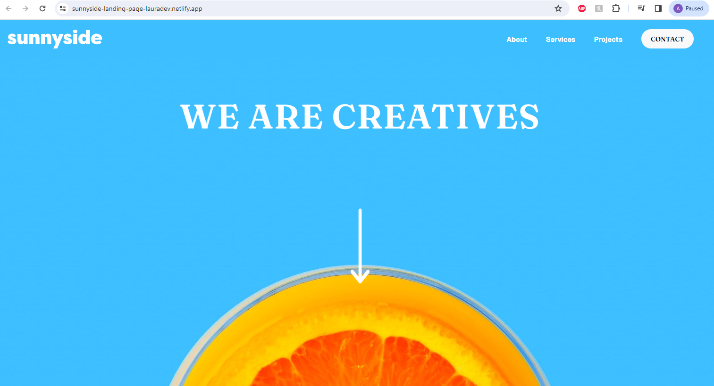
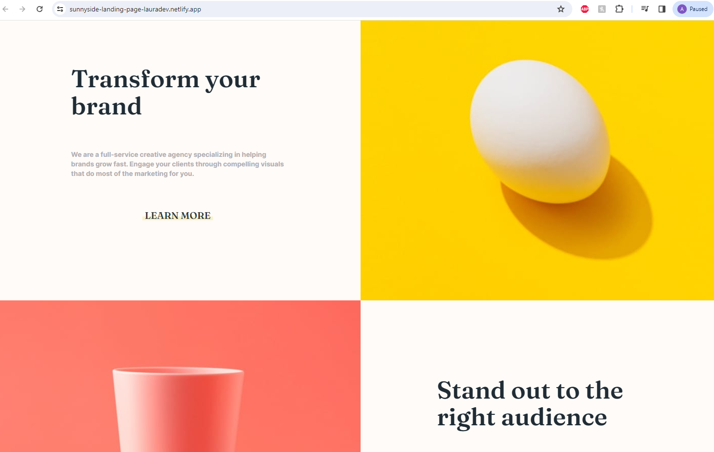
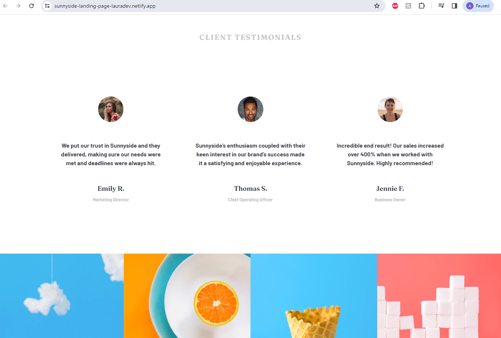
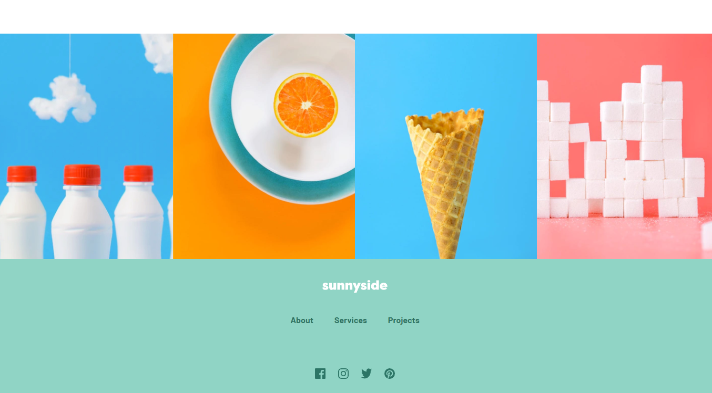

# Sunnyside Agency Landing Page

This project involved creating a replica of a agency landing page, adhering strictly to a provided design. The challenge was to match the design 1:1 without any additional guidance on the code or frameworks to be used. The primary technologies leveraged for this project were ReactJS, JavaScript, TailwindCSS, and Vite.

## Table of contents

- [Overview](#overview)
  - [The challenge](#the-challenge)
  - [Screenshot](#screenshot)
  - [Links](#links)
- [My process](#my-process)
  - [Built with](#built-with)
  - [What I learned](#what-i-learned)
  - [Continued development](#continued-development)
- [Author](#author)
- [Acknowledgments](#acknowledgments)


## Overview

The project's scope involved developing a agency landing page using ReactJS, Tailwind CSS, JavaScript, and Vite. I was provided with a collection of assets, including design examples, images, logos, and fonts. The design assets were primarily bright colored images, fonts, and fun images. The fonts used were Fraunces and Barlow. The website featured a logo in the top left corner, a desktop and mobile navigation bar, several distinct sections, a 'LEARN MORE' link button, a footer with social media and several other functional features. The project required a precise understanding of color combinations, styling, and grid container layouts.

### The challenge

The website was designed to be responsive, providing an optimal layout for any device's screen size. 

### Screenshot

Website Screenshot:


Brand Section Website Screenshot:


Client Testimonials Website Screenshot:


Footer Website Screenshot:


Project Design Requested:


### Links

- Github Repo URL: [Sunnyside Landing Page Github Repo](https://github.com/lavollmer/sunnyside-agency-landingpage)
- Solution URL: [Frontend Mentor Solution](https://www.frontendmentor.io/solutions/responsive-page-with-tailwindcss-javascript-vite-and-reactjs-W7vkV-u4l1)
- Live Site URL: [Sunnyside Landing Page](https://sunnyside-landing-page-lauradev.netlify.app/)

## My process

My process for building this website involved planning, building and refractoring code. This project took me about 2-4 business days to complete start to finish.

Project planning:
1. I began by opening the project to look through all the project images, fonts, and README. Based on this I decided what was the best way to approach this project to be the most efficient.
2. I created Github Repo and connected to my localhost/terminal. I did my first commit to make sure that everything was connected.
3. Installed ReactJS, TailwindCSS, and Vite.
4. Ran on localhost to determine everything was functioning correctly. Clean up code given from React to have a clean slate for building. 
5. Downloaded all the images in the assets folder - separated icons, images for desktop and images for mobile in folders in assets.
6. Planned build - look at designs given. Planned out reusable pieces of content.
7. Wrote out all my components and named them logically. Created my App.js and imported all the components to make sure the page would run smoothly.
8. Worked on the Icon Sunnyside Logo component to have the icon available for reuse in header and footer.
9. Worked on navigation bar. Started by working on useState hook for the mobile menu. I had to add react-router-dom to my main.jsx page to allow all the child components of App to have access to the routing context.
10. Worked on the splash page (main landing page) - Learned the spacing of the words and arrow image to have it land on the orange image as the design was shown.
11. Worked on 2 content sections - brand and audience components. 
12. Created grid container for content and 2 images on App.jsx to fill whole page.
13. Deleted LearnMore component - I realized it was easier to style and import everything into each component separately than have another component.
14. Added 2 more images to App.jsx for cherry and orange with the text overlayed based on design given.
15. Started working on client testimonials section. Added inline custom styling to the words Client Testimonials.
15. Added four images to bottom of page using grid container which quick to do.
16. worked on Footer component which included reusable Clickables component, the icon and the social media links.
17. After finishing the desktop, I started working on stylizing mobile responsive piece of the application. This took some rearranging and adding specifications for sizing for medium size screens and above.
18. I imported Google Fonts from design package given and imported into Tailwind CSS. After this, I updated all fonts within each component to match the design.
20. The final day, I worked on cleaning up mobile responsiveness and small design tweaks such as the Learn More link on mobile being centered.
21. Wrote my README and deployed to Netlify.
22. Reread my README and project to review with fresh eyes. Everything looks good!

### Built with

- Semantic HTML5 markup
- JavaScript
- Tailwind CSS
- ReactJS
- Vite
- Google Fonts
- Coolors
- CSS custom properties
- Mobile-first workflow


### What I learned

Throughout the development of this project, I gained a deeper understanding of several important concepts and tools. Here are the key learnings:

1. **Tailwind CSS Setup:** The config file has updated terminology - `purge` is now `content`. Also, `app.css` should have the Tailwind CSS utilities. At the beginning of the project, I spent some time reconfiguring the section in order to work.
2. **React useState Hook:** I learned the importance of correctly declaring the state variable and the function to update it inside an array using `useState`. I gained a deeper understanding of this concept throughout the navigation bar coding.
4. **React Router Dom:** Gained a deeper understanding of `react-router-dom` and how it works within all the files. It is a library for routing in React applications. It allows to create multiple routes in the application and render different components. I am able to create SPAs while not navigating through multiple pages and refreshing.
5. **React Router Dom Link Component:** Learned that the `Link` component doesn't support the `className` prop directly - need to wrap it with `div` or `span`.
6. **Custom Inline Styles:** I learned how to apply CSS directly to a component or element using inline styles, which are written as JavaScript objects with properties which is different than CSS with strings.
7. **Manipulating SVG Files:** I learned how to manipulate an SVG file to change its color with CSS.
8. **Text Color Props for Clickables:** I learned how to pass a color prop to the component and use that to set the text color.

``` js
const Clickables = ({ color = "text-white" }) => {
  return (
    // add 1 rem of horizontal space between its child elements and margin of 10 pixels on the left and right sides
    <div className="flex flex-row items-center space-x-10 mx-10 font-barlow font-600">
      <Link to="/about" className={`${color} text-md`}>
        About
      </Link>
      <Link to="/services" className={`${color} text-md`}>
        Services
      </Link>
      <Link to="/projects" className={`${color} text-md`}>
        Projects
      </Link>
    </div>
  );
};
```

9. **Underlining Text:** I faced challenges with underlining the "learn more" text, but eventually succeeded. I had to create a span element with proper styling that would sit below the button or Link.

```js
      <Link to="/learnmore" className="flex flex-col md:flex-row justify-center items-center md:text-left text-[#333A3B] relative">
        <p className="items-center font-fraunces font-bold font-700 text-xl relative pb-1 z-10">
          LEARN MORE
        </p>
        <span className="absolute h-2 w-1/3 bottom-2 left-0 bg-underline-color z-0 left-1/2 transform -translate-x-1/2"></span>
      </Link>
    </div>
```

10. **Importing Google Fonts in Tailwind CSS:** I learned how to import specific Google fonts and font-weights in Tailwind CSS.

Tailwind Config File
```js
module.exports = {
  content: ["./index.html", "./src/**/*.{vue,js,ts,jsx,tsx}"],
  theme: {
    extend: {
      fontFamily: {
        fraunces: ["Fraunces", "sans-serif"],
        barlow: ["Barlow", "sans-serif"],
      },
      fontWeight: {
        600: "600",
        700: "700",
        900: "900",
      },

```

App.css
```css
@import url('https://fonts.googleapis.com/css2?family=Fraunces:wght@600&family=Barlow:wght@700;900&display=swap');
```

11. **Custom Colors for Fonts in Tailwind CSS:** I learned how to set custom colors for fonts in Tailwind CSS.


### Continued development

Throughout this project, I learned a lot about Tailwind CSS, styling and how all the applications work together. I will continue learning through freeCodeCamp, Frontend Mentor challenges and self-application.

## Author

- Website - [Laura V](https://lauradeveloper.com/)
- Frontend Mentor - [@lavollmer](https://www.frontendmentor.io/profile/lavollmer)
- Github - [@lavollmer](https://github.com/lavollmer)

## Acknowledgments

Frontend Mentor challenges help you improve your coding skills by building realistic projects.
